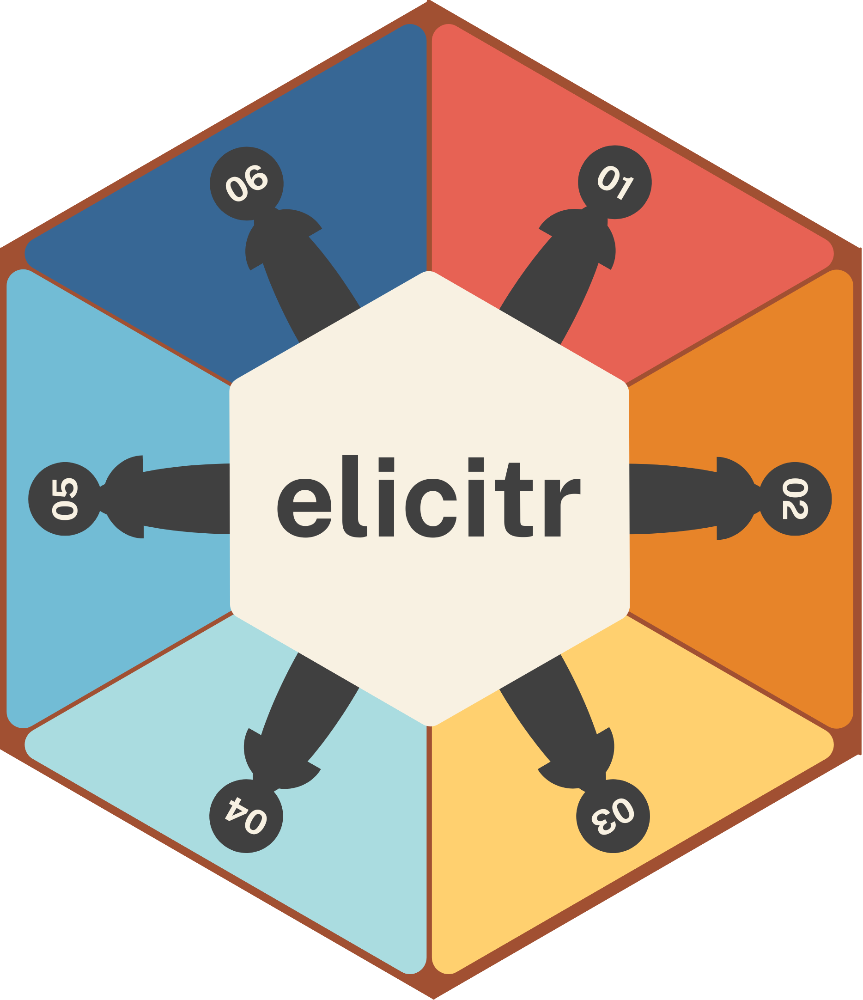
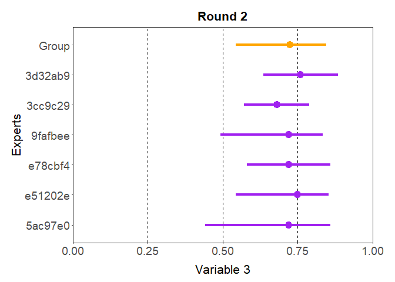

<!-- README.md is generated from README.Rmd. Please edit the .rmd file and then use devtools::build_readme() to update the md file -->

# elicitr <a href="#">

<!-- badges: start -->

[](https://www.repostatus.org/#concept)
[](https://github.com/CREWdecisions/elicitr/actions/workflows/R-CMD-check.yaml)
[](https://github.com/CREWdecisions/elicitr/actions/workflows/lint.yaml)
[](https://app.codecov.io/gh/CREWdecisions/elicitr)
<!-- badges: end -->

### Description

elicitr is an R package used to standardise, visualise and aggregate
data from expert elicitation.  
The package is in active development and will implement functions based
on two formal elicitation methods:

- Elicitation of continuous variables  
  Adapted from Hemming, V. et al. (2018). A practical guide to
  structured expert elicitation using the IDEA protocol. Methods in
  Ecology and Evolution, 9(1), 169–180.
  <https://doi.org/10.1111/2041-210X.12857>
- Elicitation of categorical data  
  Adapted from Vernet, M. et al. (2024). Assessing invasion risks using
  EICAT-based expert elicitation: application to a conservation
  translocation. Biological Invasions, 26(8), 2707–2721.
  <https://doi.org/10.1007/s10530-024-03341-2>

### Installation

You can install the development version of elicitr from GitHub with:

``` r
# install.packages("pak")
pak::pak("CREWdecisions/elicitr")
```

### Getting started

``` r
library(elicitr)
```

All the functions in the elicitr package start with the prefix `elic_`.
After that, two prefixes are available: `elic_cont` and `elic_cat`. This
design choice is intended to enhance functions discovery.  
`elic_cont` functions are used for the elicitation of continuous
variables while `elic_cat` functions for the elicitation of categorical
variables.

#### How elicitr works

Just like you create a form to collect estimates in an elicitation
process, the core of elicitr is the creation of an object to store the
metadata information. This allows to check whether experts have given
their answers in the expected way.  
Any analysis starts by creating this object with the `start` function.
Then, data can be added and retrieved using the `add_data` and
`get_data` functions respectively. Finally data can be plotted using the
`plot` function. Details about the implementation and example usages of
these functions based on the simulated datasets included in elicitr can
be seen bellow.  
In total, there are five simulated datasets provided in the package.
They are intended to demonstrate the functionality of the package and do
not represent an actual elicitation process (names are also randomly
generated).

### Elicitation of continuous variables

#### Simulated datasets

Two datasets that simulate the elicitation of continuous variables are
included in elicitr:

``` r
round_1
#> # A tibble: 6 × 9
#>   name         var1_best var2_min var2_max var2_best var3_min var3_max var3_best
#>   <chr>            <int>    <int>    <int>     <int>    <dbl>    <dbl>     <dbl>
#> 1 Derek Macle…         1       20       24        22     0.43     0.83      0.73
#> 2 Christopher…         0        7       10         9     0.67     0.87      0.77
#> 3 Mar'Quasa B…         0       10       15        12     0.65     0.95      0.85
#> 4 Mastoora al…        -7        4       12         9     0.44     0.84      0.64
#> 5 Eriberto Mu…        -5       13       18        16     0.38     0.88      0.68
#> 6 Paul Bol             3       20       26        25     0.35     0.85      0.65
#> # ℹ 1 more variable: var3_conf <int>
```

``` r
round_2
#> # A tibble: 6 × 9
#>   name         var1_best var2_min var2_max var2_best var3_min var3_max var3_best
#>   <chr>            <int>    <int>    <int>     <int>    <dbl>    <dbl>     <dbl>
#> 1 Mar'Quasa B…        -2       15       21        18     0.62     0.82      0.72
#> 2 Mastoora al…        -4       11       15        12     0.52     0.82      0.72
#> 3 Eriberto Mu…         1       15       20        17     0.58     0.78      0.68
#> 4 Derek Macle…         0       11       18        15     0.52     0.82      0.72
#> 5 Christopher…        -2       14       18        15     0.55     0.85      0.75
#> 6 Paul Bol             1       18       23        20     0.66     0.86      0.76
#> # ℹ 1 more variable: var3_conf <int>
```

#### Functions

Any analysis of continuous variables starts by creating the `elic_cont`
object with the function `cont_start()` to store the metadata of the
elicitation. To build this `elic_cont` object, four parameters must be
specified:

- `var` the number of variables (i.e. the number of topics in your
  elicitation)
- `var_types` the type of variables for each of these variables (many
  options are available, ranging from real numbers to probabilities)
- `elic_types` the type of elicitation for each of these variables
  (three options are available: one, three, and four points
  elicitations)
- `experts` the number of experts that replied to the elicitation

``` r
my_elicitation_cont <- cont_start(var = c("var1", "var2", "var3"),
                                  var_types = "ZNp",
                                  elic_types = "134",
                                  experts = 6,
                                  title = "Continuous elicitation example")
#> ✔ <elic_cont> object for "Continuous elicitation example" correctly initialised
```

``` r
my_elicitation_cont
#> 
#> ── Continuous elicitation example ──
#> 
#> • Variables: "var1", "var2", and "var3"
#> • Variable types: "Z", "N", and "p"
#> • Elicitation types: "1p", "3p", and "4p"
#> • Number of experts: 6
#> • Number of rounds: 0
```

Once the metadata has been added to the `elic_cont` object, the data of
the first round of elicitation can be added with the function
`cont_add_data()`:

``` r
my_elicitation_cont <- cont_add_data(my_elicitation_cont,
                                     data_source = round_1,
                                     round = 1)
#> ✔ Data added to "Round 1" from "data.frame"
```

The information message confirms that the data for the first round has
been added to the `elic_cont` object from a `data.frame`. Besides
`data frames`, elicitr also allows users to add data from `.csv` or
`.xlsx` files, and from Google Sheets.

If you conducted a second round of elicitation, it can be added to the
`elic_cont` object after the first round has been added:

``` r
my_elicitation_cont <- cont_add_data(my_elicitation_cont,
                                     data_source = round_2,
                                     round = 2)
#> ✔ Data added to "Round 2" from "data.frame"
```

To keep the anonymity of experts, their names are converted to short
sha1 hashes and saved in the `id` column. These are then used to match
the expert’s answers in the two rounds.

The function `cont_get_data()` retrieves data from an `elic_cont`
object. It is possible to get the whole dataset of a given round, or
extract only the data for a given variable, variable type, or
elicitation type:

``` r
cont_get_data(my_elicitation_cont,
              round = 1,
              var = "all")
#> # A tibble: 6 × 9
#>   id      var1_best var2_min var2_max var2_best var3_min var3_max var3_best
#>   <chr>       <int>    <int>    <int>     <int>    <dbl>    <dbl>     <dbl>
#> 1 5ac97e0         1       20       24        22     0.43     0.83      0.73
#> 2 e51202e         0        7       10         9     0.67     0.87      0.77
#> 3 e78cbf4         0       10       15        12     0.65     0.95      0.85
#> 4 9fafbee        -7        4       12         9     0.44     0.84      0.64
#> 5 3cc9c29        -5       13       18        16     0.38     0.88      0.68
#> 6 3d32ab9         3       20       26        25     0.35     0.85      0.65
#> # ℹ 1 more variable: var3_conf <int>
```

Finally, data can be plotted using the function `cont_plot()`. This
function plots data belonging to a given round and for a given variable.

``` r
cont_plot(my_elicitation_cont,
          round = 2,
          group = TRUE,
          var = "var3",
          xlab = "Variable 3")
#> ✔ Rescaled min and max
```



Variable 3 (the plotted variable) is the result of a four points
elicitation, where minimum and maximum estimates, best guess, and expert
confidence is provided. In the plot, the best guess is represented with
a dot, and the range between minimum and maximum estimates is
represented with a line. Expert estimates are represented in purple,
while the group’s mean is represented in orange.

The message printed when the function is ran informs users that the
minimum and maximum value given by experts have been rescaled using
their provided confidence level.

### Elicitation of categorical variables

#### Simulated datasets

Three datasets that simulate the elicitation of categorical variables
are included in elicitr:

``` r
mechanism_1
#> # A tibble: 120 × 5
#>    name            level   site   confidence estimate
#>    <chr>           <chr>   <chr>       <dbl>    <dbl>
#>  1 Derek Maclellan level_1 site_1         15     0.08
#>  2 Derek Maclellan level_2 site_1         15     0   
#>  3 Derek Maclellan level_3 site_1         15     0.84
#>  4 Derek Maclellan level_4 site_1         15     0.02
#>  5 Derek Maclellan level_5 site_1         15     0.06
#>  6 Derek Maclellan level_1 site_2         35     0.02
#>  7 Derek Maclellan level_2 site_2         35     0.11
#>  8 Derek Maclellan level_3 site_2         35     0.19
#>  9 Derek Maclellan level_4 site_2         35     0.02
#> 10 Derek Maclellan level_5 site_2         35     0.66
#> # ℹ 110 more rows
```

``` r
mechanism_2
#> # A tibble: 100 × 5
#>    name              level   site   confidence estimate
#>    <chr>             <chr>   <chr>       <dbl>    <dbl>
#>  1 Christopher Felix level_1 site_1        100     0.09
#>  2 Christopher Felix level_2 site_1        100     0.21
#>  3 Christopher Felix level_3 site_1        100     0.11
#>  4 Christopher Felix level_4 site_1        100     0.59
#>  5 Christopher Felix level_5 site_1        100     0   
#>  6 Christopher Felix level_1 site_2         20     0.09
#>  7 Christopher Felix level_2 site_2         20     0.04
#>  8 Christopher Felix level_3 site_2         20     0.33
#>  9 Christopher Felix level_4 site_2         20     0.23
#> 10 Christopher Felix level_5 site_2         20     0.31
#> # ℹ 90 more rows
```

``` r
mechanism_3
#> # A tibble: 90 × 5
#>    name            level   site   confidence estimate
#>    <chr>           <chr>   <chr>       <dbl>    <dbl>
#>  1 Derek Maclellan level_1 site_1         80     0.02
#>  2 Derek Maclellan level_2 site_1         80     0.02
#>  3 Derek Maclellan level_3 site_1         80     0.01
#>  4 Derek Maclellan level_4 site_1         80     0.87
#>  5 Derek Maclellan level_5 site_1         80     0.08
#>  6 Derek Maclellan level_1 site_2         50     0.11
#>  7 Derek Maclellan level_2 site_2         50     0.09
#>  8 Derek Maclellan level_3 site_2         50     0.17
#>  9 Derek Maclellan level_4 site_2         50     0.1 
#> 10 Derek Maclellan level_5 site_2         50     0.53
#> # ℹ 80 more rows
```

#### Functions

Just like continuous variables, any analysis of categorical variables
starts by creating the `elic_cat` object with the function `cat_start()`
to store the metadata of the elicitation. To build this `elic_cat`
object, four parameters must be specified:

- `levels` the names of the levels of impact you used in your
  elicitation
- `sites` the names of all sites investigated
- `experts` the maximum number of experts participating in the
  elicitation process for one mechanism
- `mechanisms` the names of the mechanisms of impact investigated

``` r
my_elicitation_cat <- cat_start(levels = c("level_1", "level_2", "level_3", "level_4", "level_5"),
                                sites = c("site_1", "site_2", "site_3", "site_4"),
                                experts = 6,
                                mechanisms = c("mechanism_1","mechanism_2", "mechanism_3"),
                                title = "Categorical elicitation example")
#> ✔ <elic_cat> object for "Categorical elicitation example" correctly initialised
```

``` r
my_elicitation_cat
#> 
#> ── Categorical elicitation example ──
#> 
#> • Levels: "level_1", "level_2", "level_3", "level_4", and "level_5"
#> • Sites: "site_1", "site_2", "site_3", and "site_4"
#> • Number of experts: 6
#> • Mechanisms: "mechanism_1", "mechanism_2", and "mechanism_3"
#> • Data available for 0 mechanisms
```

#### Functions under development

- `cat_add_data()`
- `cat_get_data()`
- `elic_cat_plot_data`

### Similar packages

- {shelf} : Oakley, J. (2024). Package “SHELF” Tools to Support the
  Sheffield Elicitation Framework.
  <https://doi.org/10.32614/CRAN.package.SHELF>
- {prefR} : Lepird, J. (2022). Package “prefeR” R Package for Pairwise
  Preference Elicitation. <https://doi.org/10.32614/CRAN.package.prefeR>
