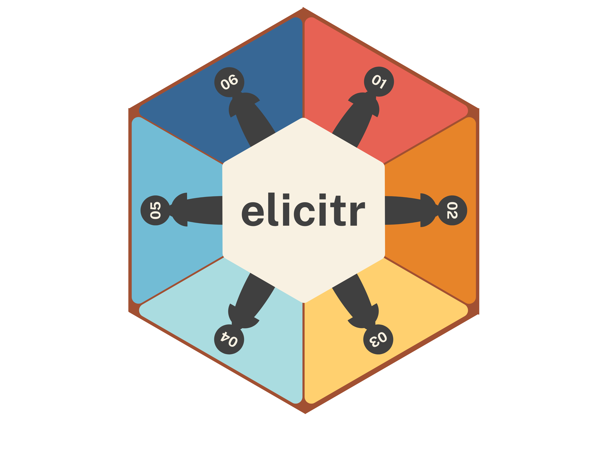
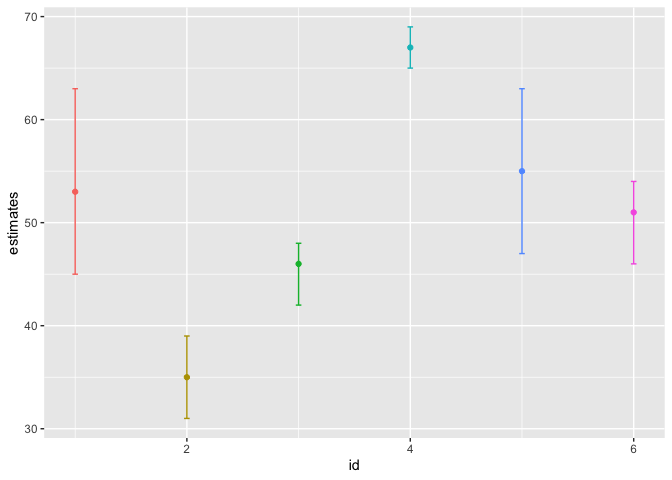

<!-- README.md is generated from README.Rmd. Please edit that file -->

# elicitr

<!-- badges: start -->

[](https://www.repostatus.org/#concept)
<!-- badges: end -->

Elicitr is an R package, used to aggregate elicitation data from
googlesheets. This package follows two formal elicitation methods:

- Continuous method (adapted from delphi-protocol for expert
  elicitation)
- Categorical method (adapted from Vernet et al. (2020, Biological
  invasion))



## Installation

You can install the development version of elicitr from
[GitHub](https://github.com/) with:

``` r
#install.packages("pak")
pak::pak("sgvignali/elicitr")
```

## Example

This simulated dataset can be used to unterstand how {elicitr} works.

Three types of variables are included here:

- “percentage” i.e. \[0,1\]
- “positive numbers” i.e. \[0,inf)
- “real numbers” i.e. (-inf,inf)

And three types of elicitations:

- One point estimate (var1_best)  
- Three point estimate (var2_min, var2_max, var2_best)  
- Four point estimate (var3_min, var3_max, var3_best, var3_conf)  

<!-- -->

    #>   id var1_best var2_min var2_max var2_best var3_min var3_max var3_best
    #> 1  1       0.8       45       63        53       -1       -6        -1
    #> 2  2       0.9       31       39        35      -18      -22       -17
    #> 3  3       0.7       42       48        46       -5      -19       -13
    #> 4  4       1.0       65       69        67        0       -8        -5
    #> 5  5       0.7       47       63        55      -19      -13       -15
    #> 6  6       1.0       46       54        51        0        0         1
    #>   var3_conf
    #> 1        89
    #> 2        93
    #> 3        98
    #> 4       100
    #> 5        81
    #> 6        60

This is a basic example which shows you how to use {elicitr} to analyse
this data:

``` r
#library(elicitr)
#elicitate(elicit)
## fake function elicitate, replace with actual function
```



## Related work

The functioning and application of {elicitr} is related to following R
packages:

- {shelf} : <https://shelf.sites.sheffield.ac.uk/software>
- {prefR} : <https://jlepird.github.io/prefeR/>

## Bibliography

We used R version 4.4.1 (R Core Team 2024) and the following R packages:
devtools v. 2.4.5 (Wickham et al. 2022), knitr v. 1.48 (Xie 2014, 2015,
2024), rmarkdown v. 2.28 (Xie, Allaire, and Grolemund 2018; Xie,
Dervieux, and Riederer 2020; Allaire et al. 2024), tidyverse v. 2.0.0
(Wickham et al. 2019), truncnorm v. 1.0.9 (Mersmann et al. 2023).

<div id="refs" class="references csl-bib-body hanging-indent">

<div id="ref-rmarkdown2024" class="csl-entry">

Allaire, JJ, Yihui Xie, Christophe Dervieux, Jonathan McPherson, Javier
Luraschi, Kevin Ushey, Aron Atkins, et al. 2024.
*<span class="nocase">rmarkdown</span>: Dynamic Documents for r*.
<https://github.com/rstudio/rmarkdown>.

</div>

<div id="ref-truncnorm" class="csl-entry">

Mersmann, Olaf, Heike Trautmann, Detlef Steuer, and Björn Bornkamp.
2023. *<span class="nocase">truncnorm</span>: Truncated Normal
Distribution*. <https://CRAN.R-project.org/package=truncnorm>.

</div>

<div id="ref-base" class="csl-entry">

R Core Team. 2024. *R: A Language and Environment for Statistical
Computing*. Vienna, Austria: R Foundation for Statistical Computing.
<https://www.R-project.org/>.

</div>

<div id="ref-tidyverse" class="csl-entry">

Wickham, Hadley, Mara Averick, Jennifer Bryan, Winston Chang, Lucy
D’Agostino McGowan, Romain François, Garrett Grolemund, et al. 2019.
“Welcome to the <span class="nocase">tidyverse</span>.” *Journal of Open
Source Software* 4 (43): 1686. <https://doi.org/10.21105/joss.01686>.

</div>

<div id="ref-devtools" class="csl-entry">

Wickham, Hadley, Jim Hester, Winston Chang, and Jennifer Bryan. 2022.
*<span class="nocase">devtools</span>: Tools to Make Developing r
Packages Easier*. <https://CRAN.R-project.org/package=devtools>.

</div>

<div id="ref-knitr2014" class="csl-entry">

Xie, Yihui. 2014. “<span class="nocase">knitr</span>: A Comprehensive
Tool for Reproducible Research in R.” In *Implementing Reproducible
Computational Research*, edited by Victoria Stodden, Friedrich Leisch,
and Roger D. Peng. Chapman; Hall/CRC.

</div>

<div id="ref-knitr2015" class="csl-entry">

———. 2015. *Dynamic Documents with R and Knitr*. 2nd ed. Boca Raton,
Florida: Chapman; Hall/CRC. <https://yihui.org/knitr/>.

</div>

<div id="ref-knitr2024" class="csl-entry">

———. 2024. *<span class="nocase">knitr</span>: A General-Purpose Package
for Dynamic Report Generation in r*. <https://yihui.org/knitr/>.

</div>

<div id="ref-rmarkdown2018" class="csl-entry">

Xie, Yihui, J. J. Allaire, and Garrett Grolemund. 2018. *R Markdown: The
Definitive Guide*. Boca Raton, Florida: Chapman; Hall/CRC.
<https://bookdown.org/yihui/rmarkdown>.

</div>

<div id="ref-rmarkdown2020" class="csl-entry">

Xie, Yihui, Christophe Dervieux, and Emily Riederer. 2020. *R Markdown
Cookbook*. Boca Raton, Florida: Chapman; Hall/CRC.
<https://bookdown.org/yihui/rmarkdown-cookbook>.

</div>

</div>
