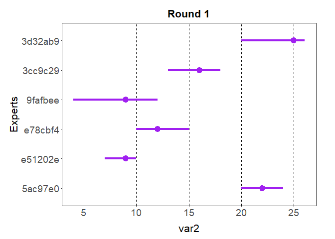
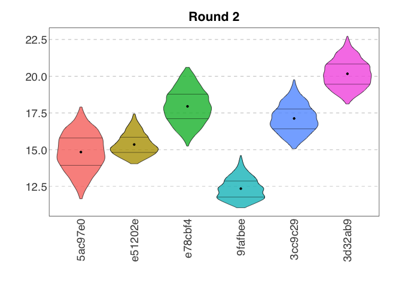
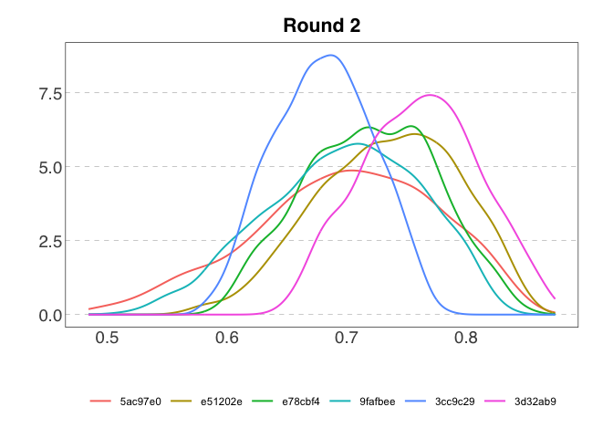

<!-- README.md is generated from README.Rmd. Please edit the .rmd file and then use devtools::build_readme() to update the md file -->

# elicitr <a href="#">

<!-- badges: start -->

[](https://www.repostatus.org/#concept)
[](https://github.com/CREWdecisions/elicitr/actions/workflows/R-CMD-check.yaml)
[](https://github.com/CREWdecisions/elicitr/actions/workflows/lint.yaml)
[](https://app.codecov.io/gh/CREWdecisions/elicitr)
<!-- badges: end -->

## Description

elicitr is an R package used to standardise, visualise and aggregate
data from expert elicitation.  
The package is in active development and will implement functions based
on two formal elicitation methods:

- Elicitation of continuous variables  
  Adapted from Hemming, V. et al. (2018). A practical guide to
  structured expert elicitation using the IDEA protocol. Methods in
  Ecology and Evolution, 9(1), 169–180.
  <https://doi.org/10.1111/2041-210X.12857>
- Elicitation of categorical data  
  Adapted from Vernet, M. et al. (2024). Assessing invasion risks using
  EICAT-based expert elicitation: application to a conservation
  translocation. Biological Invasions, 26(8), 2707–2721.
  <https://doi.org/10.1007/s10530-024-03341-2>

## Installation

You can install the development version of elicitr from GitHub with:

``` r
# install.packages("pak")
pak::pak("CREWdecisions/elicitr")
```

## How elicitr works

Just as one creates a form to collect estimates in an elicitation
process, with elicitr one creates an object to store metadata
information. This allows to check whether experts have given their
answers in the expected way.  
All the functions in the elicitr package start with two prefixes: `cont`
and `cat`. This design choice is intended to enhance functions
discovery. `cont` functions are used for the elicitation of continuous
variables while `cat` functions for the elicitation of categorical
variables.

## Getting started

``` r
library(elicitr)
```

Create the metadata object and load the data for continuous variables:

``` r
my_elicitation <- cont_start(var_names = c("var1", "var2", "var3"),
                             var_types = "ZNp",
                             elic_types = "134",
                             experts = 6) |>
  cont_add_data(data_source = round_1, round = 1) |>
  cont_add_data(data_source = round_2, round = 2)
#> ✔ <elic_cont> object for "Elicitation" correctly initialised
#> ✔ Data added to "Round 1" from "data.frame"
#> ✔ Data added to "Round 2" from "data.frame"
my_elicitation
#> 
#> ── Elicitation ──
#> 
#> • Variables: "var1", "var2", and "var3"
#> • Variable types: "Z", "N", and "p"
#> • Elicitation types: "1p", "3p", and "4p"
#> • Number of experts: 6
#> • Number of rounds: 2
```

Plot raw data for variable 2 in round 1:

``` r
plot(my_elicitation, round = 1, var = "var2")
```



Data can be sampled from the elicitation object:

``` r
samp <- cont_sample_data(my_elicitation, round = 2)
#> ✔ Rescaled min and max for variable "var3".
#> ✔ Data for "var1", "var2", and "var3" sampled successfully using the "basic" method.
samp
#> # A tibble: 18,000 × 3
#>    id      var   value
#>    <chr>   <chr> <dbl>
#>  1 5ac97e0 var1     -2
#>  2 5ac97e0 var1     -2
#>  3 5ac97e0 var1      1
#>  4 5ac97e0 var1      1
#>  5 5ac97e0 var1     -2
#>  6 5ac97e0 var1      0
#>  7 5ac97e0 var1      0
#>  8 5ac97e0 var1     -2
#>  9 5ac97e0 var1      0
#> 10 5ac97e0 var1     -2
#> # ℹ 17,990 more rows
```

And the sample summarised:

``` r
summary(samp)
#> # A tibble: 3 × 7
#>   Var      Min     Q1 Median   Mean     Q3    Max
#>   <chr>  <dbl>  <dbl>  <dbl>  <dbl>  <dbl>  <dbl>
#> 1 var1  -4     -2      0     -0.986  1      1    
#> 2 var2  11.0   14.5   16.2   16.3   18.4   22.5  
#> 3 var3   0.464  0.672  0.717  0.715  0.761  0.870
```

And plotted as violin plots:

``` r
plot(samp, var = "var2", type = "violin")
```



Or plotted as density plots:

``` r
plot(samp, var = "var3", type = "density")
```



## Similar packages

- {shelf} : Oakley, J. (2024). Package “SHELF” Tools to Support the
  Sheffield Elicitation Framework.
  <https://doi.org/10.32614/CRAN.package.SHELF>
- {prefR} : Lepird, J. (2022). Package “prefeR” R Package for Pairwise
  Preference Elicitation. <https://doi.org/10.32614/CRAN.package.prefeR>
