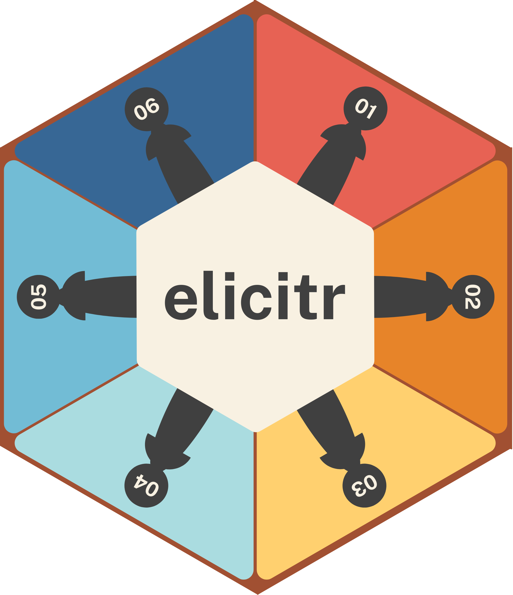

<!-- README.md is generated from README.Rmd. Please edit the .rmd file and then use devtools::build_readme() to update the md file -->

# elicitr <a href="#">

<!-- badges: start -->

[](https://www.repostatus.org/#concept)
[](https://github.com/CREWdecisions/elicitr/actions/workflows/R-CMD-check.yaml)
[](https://github.com/CREWdecisions/elicitr/actions/workflows/lint.yaml)
[](https://app.codecov.io/gh/CREWdecisions/elicitr)
<!-- badges: end -->

### Description

elicitr is an R package used to standardise, visualise and aggregate
data from expert elicitation.  
The package is in active development and will implement functions based
on two formal elicitation methods:

- Elicitation of continuous variables  
  Adapted from Hemming, V. et al. (2018). A practical guide to
  structured expert elicitation using the IDEA protocol. Methods in
  Ecology and Evolution, 9(1), 169–180.
  <https://doi.org/10.1111/2041-210X.12857>
- Elicitation of categorical data  
  Adapted from Vernet, M. et al. (2024). Assessing invasion risks using
  EICAT-based expert elicitation: application to a conservation
  translocation. Biological Invasions, 26(8), 2707–2721.
  <https://doi.org/10.1007/s10530-024-03341-2>

### Installation

You can install the development version of elicitr from GitHub with:

``` r
# install.packages("pak")
pak::pak("CREWdecisions/elicitr")
```

### Getting started

elicitr works by

``` r
library(elicitr)
```

##### Elicitation of continuous variables

###### Simulated datasets

Two simulated datasets are included in elicitr:  

``` r
elicitr::round_1
#> # A tibble: 6 × 9
#>   name         var1_best var2_min var2_max var2_best var3_min var3_max var3_best
#>   <chr>            <int>    <int>    <int>     <int>    <dbl>    <dbl>     <dbl>
#> 1 Derek Macle…         1       20       24        22     0.43     0.83      0.73
#> 2 Christopher…         0        7       10         9     0.67     0.87      0.77
#> 3 Mar'Quasa B…         0       10       15        12     0.65     0.95      0.85
#> 4 Mastoora al…        -7        4       12         9     0.44     0.84      0.64
#> 5 Eriberto Mu…        -5       13       18        16     0.38     0.88      0.68
#> 6 Paul Bol             3       20       26        25     0.35     0.85      0.65
#> # ℹ 1 more variable: var3_conf <int>
```

### 

``` r
elicitr::round_2
#> # A tibble: 6 × 9
#>   name         var1_best var2_min var2_max var2_best var3_min var3_max var3_best
#>   <chr>            <int>    <int>    <int>     <int>    <dbl>    <dbl>     <dbl>
#> 1 Mar'Quasa B…        -2       15       21        18     0.62     0.82      0.72
#> 2 Mastoora al…        -4       11       15        12     0.52     0.82      0.72
#> 3 Eriberto Mu…         1       15       20        17     0.58     0.78      0.68
#> 4 Derek Macle…         0       11       18        15     0.52     0.82      0.72
#> 5 Christopher…        -2       14       18        15     0.55     0.85      0.75
#> 6 Paul Bol             1       18       23        20     0.66     0.86      0.76
#> # ℹ 1 more variable: var3_conf <int>
```

###### First step: create your object of class elicit

``` r
elicit_object <- elicitr::elic_start(var = c("var1", "var2", "var3"),
                                          var_types = "ZNs",
                                          elic_types = "134",
                                          experts = 6)
#> ✔ `elicit` object for "Elicitation" correctly initialised
```

###### Second step: add your data for round 1

``` r
round1_elicit <- elicitr::elic_add_data(elicit_object,
                                             elicitr::round_1,
                                             round = 1)
#> ✔ Data added to "Round 1" from "data.frame"
```

###### Third step: add your data for round 2

``` r
round2_elicit <- elicitr::elic_add_data(round1_elicit,
                                             elicitr::round_2,
                                             round = 2)
#> ✔ Data added to "Round 2" from "data.frame"
```

###### Fourth step: check your data

``` r
elicitr::elic_get_data(round2_elicit, round = 1, var = "all")
#> # A tibble: 6 × 9
#>   id      var1_best var2_min var2_max var2_best var3_min var3_max var3_best
#>   <chr>       <int>    <int>    <int>     <int>    <dbl>    <dbl>     <dbl>
#> 1 5ac97e0         1       20       24        22     0.43     0.83      0.73
#> 2 e51202e         0        7       10         9     0.67     0.87      0.77
#> 3 e78cbf4         0       10       15        12     0.65     0.95      0.85
#> 4 9fafbee        -7        4       12         9     0.44     0.84      0.64
#> 5 3cc9c29        -5       13       18        16     0.38     0.88      0.68
#> 6 3d32ab9         3       20       26        25     0.35     0.85      0.65
#> # ℹ 1 more variable: var3_conf <int>
```

###### Final step: plot your data

``` r
elicitr::elic_plot(round2_elicit,
                        round = 2,
                        group = TRUE,
                        var = "var3",
                        xlab = "variable 3",
                        ylab = "Experts")
#> ✔ Rescaled min and max
```


##### Elicitation of continuous variables

###### In development

### Similar packages

- {shelf} : Oakley, J. (2024). Package “SHELF” Tools to Support the
  Sheffield Elicitation Framework.
  <https://doi.org/10.32614/CRAN.package.SHELF>
- {prefR} : Lepird, J. (2022). Package “prefeR” R Package for Pairwise
  Preference Elicitation. <https://doi.org/10.32614/CRAN.package.prefeR>
