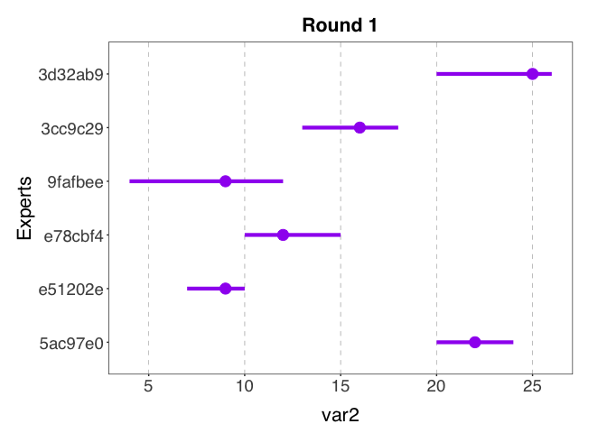
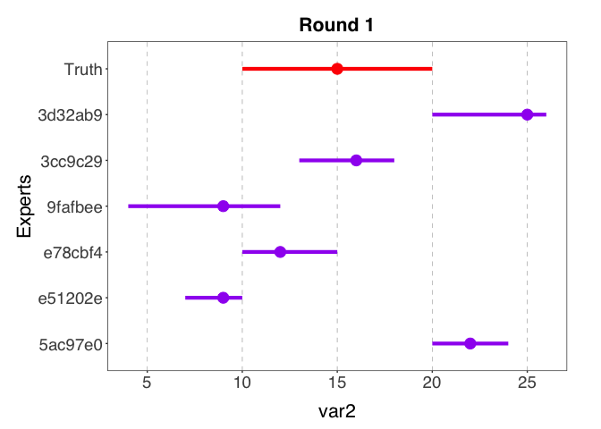
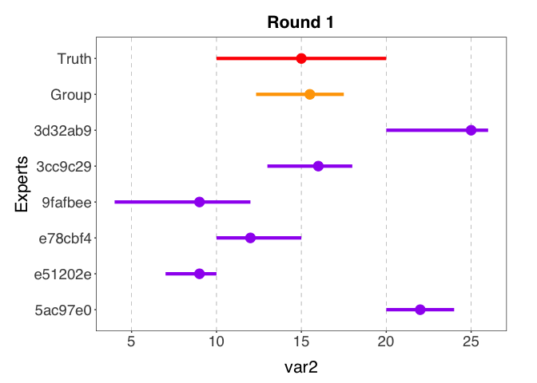

# elicitr

## Description

elicitr is an R package used to standardise, visualise and aggregate
data from expert elicitation.  
The package is in active development and will implement functions based
on two formal elicitation methods:

- Elicitation of continuous variables  
  Adapted from Hemming, V. et al. (2018). A practical guide to
  structured expert elicitation using the IDEA protocol. Methods in
  Ecology and Evolution, 9(1), 169–180.
  <https://doi.org/10.1111/2041-210X.12857>
- Elicitation of categorical data  
  Adapted from Vernet, M. et al. (2024). Assessing invasion risks using
  EICAT-based expert elicitation: application to a conservation
  translocation. Biological Invasions, 26(8), 2707–2721.
  <https://doi.org/10.1007/s10530-024-03341-2>

## Installation

You can install the development version of elicitr from R universe using

``` r

install.packages("elicitr", 
                 repos = c('https://crewdecisions.r-universe.dev',
                 'https://cloud.r-project.org'))
```

## How elicitr works

Just as one creates a form to collect estimates in an elicitation
process, with elicitr one creates an object to store metadata
information. This allows to check whether experts have given their
answers in the expected way.  
All the functions in the elicitr package start with two prefixes: `cont`
and `cat`. This design choice is intended to enhance functions
discovery. `cont` functions are used for the elicitation of continuous
variables while `cat` functions for the elicitation of categorical
variables.

## Getting started

``` r

library(elicitr)
```

### Elicitation of continuous variables

Create the metadata object that will be able to hold the continuous data
based on the elicitation design:

``` r

my_elic_cont <- cont_start(var_names = c("var1", "var2", "var3"),
                           var_types = "ZNp",
                           elic_types = "134",
                           experts = 6)
#> ✔ <elic_cont> object for "Elicitation" correctly initialised

my_elic_cont
#> 
#> ── Elicitation ──
#> 
#> • Variables: "var1", "var2", and "var3"
#> • Variable types: "Z", "N", and "p"
#> • Elicitation types: "1p", "3p", and "4p"
#> • Number of experts: 6
#> • Number of rounds: 0
```

Load the continuous data into the metadata object (round_1 and round_2
data are provided as example datasets in the package). This is how your
data should look like before they are added to the metadata:

``` r

round_1
#> # A tibble: 6 × 9
#>   name         var1_best var2_min var2_max var2_best var3_min var3_max var3_best
#>   <chr>            <int>    <int>    <int>     <int>    <dbl>    <dbl>     <dbl>
#> 1 Derek Macle…         1       20       24        22     0.43     0.83      0.73
#> 2 Christopher…         0        7       10         9     0.67     0.87      0.77
#> 3 Mar'Quasa B…         0       10       15        12     0.65     0.95      0.85
#> 4 Mastoora al…        -7        4       12         9     0.44     0.84      0.64
#> 5 Eriberto Mu…        -5       13       18        16     0.38     0.88      0.68
#> 6 Paul Bol             3       20       26        25     0.35     0.85      0.65
#> # ℹ 1 more variable: var3_conf <int>

round_2
#> # A tibble: 6 × 9
#>   name         var1_best var2_min var2_max var2_best var3_min var3_max var3_best
#>   <chr>            <int>    <int>    <int>     <int>    <dbl>    <dbl>     <dbl>
#> 1 Mar'Quasa B…        -2       15       21        18     0.62     0.82      0.72
#> 2 Mastoora al…        -4       11       15        12     0.52     0.82      0.72
#> 3 Eriberto Mu…         1       15       20        17     0.58     0.78      0.68
#> 4 Derek Macle…         0       11       18        15     0.52     0.82      0.72
#> 5 Christopher…        -2       14       18        15     0.55     0.85      0.75
#> 6 Paul Bol             1       18       23        20     0.66     0.86      0.76
#> # ℹ 1 more variable: var3_conf <int>
```

Load the data into the metadata object: Data can also be imported from a
GoogleSheet. See the function documentation for more details.

``` r

my_elic_cont <- cont_add_data(my_elic_cont,
                              data_source = round_1,
                              round = 1)
#> ✔ Data added to "Round 1" from "data.frame"
my_elic_cont <- cont_add_data(my_elic_cont,
                              data_source = round_2,
                              round = 2)
#> ✔ Data added to "Round 2" from "data.frame"
my_elic_cont
#> 
#> ── Elicitation ──
#> 
#> • Variables: "var1", "var2", and "var3"
#> • Variable types: "Z", "N", and "p"
#> • Elicitation types: "1p", "3p", and "4p"
#> • Number of experts: 6
#> • Number of rounds: 2
```

View the data stored in the elicitation object:

``` r

cont_get_data(my_elic_cont, round = 1)
#> # A tibble: 6 × 9
#>   id      var1_best var2_min var2_max var2_best var3_min var3_max var3_best
#>   <chr>       <int>    <int>    <int>     <int>    <dbl>    <dbl>     <dbl>
#> 1 5ac97e0         1       20       24        22     0.43     0.83      0.73
#> 2 e51202e         0        7       10         9     0.67     0.87      0.77
#> 3 e78cbf4         0       10       15        12     0.65     0.95      0.85
#> 4 9fafbee        -7        4       12         9     0.44     0.84      0.64
#> 5 3cc9c29        -5       13       18        16     0.38     0.88      0.68
#> 6 3d32ab9         3       20       26        25     0.35     0.85      0.65
#> # ℹ 1 more variable: var3_conf <int>
```

Plot raw data for variable 2 in round 1:

``` r

plot(my_elic_cont, round = 1, var = "var2")
```



When the elicitation process is part of a workshop and is used for
demonstration, it can be useful to show a truth argumenton the plot.
This argument can be added as a list of estimates.

``` r

plot(my_elic_cont, round = 1, var = "var2",
     truth = list(min = 10, max = 20, best = 15))
```



Estimates can also be plotted grouped across experts:

``` r

plot(my_elic_cont, round = 1, var = "var2",
     truth = list(min = 10, max = 20, best = 15),
     group = TRUE)
```



Data can be sampled from the elicitation object:

``` r

samp_cont <- cont_sample_data(my_elic_cont, round = 2)
#> ✔ Rescaled min and max for variable "var3".
#> ✔ Data for "var1", "var2", and "var3" sampled successfully using the "PERT" method.

samp_cont
#> # A tibble: 18,000 × 3
#>    id      var   value
#>    <chr>   <chr> <dbl>
#>  1 5ac97e0 var1      0
#>  2 5ac97e0 var1      0
#>  3 5ac97e0 var1      0
#>  4 5ac97e0 var1      0
#>  5 5ac97e0 var1      0
#>  6 5ac97e0 var1      0
#>  7 5ac97e0 var1      0
#>  8 5ac97e0 var1      0
#>  9 5ac97e0 var1      0
#> 10 5ac97e0 var1      0
#> # ℹ 17,990 more rows
```

And the sample summarised:

``` r

summary(samp_cont)
#> # A tibble: 3 × 7
#>   Var      Min     Q1 Median   Mean     Q3    Max
#>   <chr>  <dbl>  <dbl>  <dbl>  <dbl>  <dbl>  <dbl>
#> 1 var1  -4     -2     -1     -1      1      1    
#> 2 var2  11.0   14.5   16.3   16.3   18.4   22.8  
#> 3 var3   0.485  0.670  0.716  0.715  0.762  0.880
```

And plotted as violin plots:

``` r

plot(samp_cont, var = "var2", type = "violin")
```


Or plotted as density plots:

``` r

plot(samp_cont, var = "var3", type = "density")
```


And can be grouped across experts:

``` r

plot(samp_cont, var = "var3", type = "density",
     group = TRUE)
```


### Elicitation of categorical variables

Create the metadata object that will be able to hold the categorical
data based on the elicitation design: Categories correspond to impact
levels and options to islands in Vernet, M. et al. (2024).

``` r

my_elic_cat <- cat_start(topics = c("Mechanism1",
                                    "Mechanism2",
                                    "Mechanism3"),
                         options = c("option_1",
                                     "option_2",
                                     "option_3",
                                     "option_4"),
                         categories = c("category_1",
                                        "category_2",
                                        "category_3",
                                        "category_4",
                                        "category_5"),
                         experts = 6)
#> ✔ <elic_cat> object for "Elicitation" correctly initialised

my_elic_cat
#> 
#> ── Elicitation ──
#> 
#> • Categories: "category_1", "category_2", "category_3", "category_4", and
#> "category_5"
#> • Options: "option_1", "option_2", "option_3", and "option_4"
#> • Number of experts: 6
#> • Topics: "Mechanism1", "Mechanism2", and "Mechanism3"
#> • Data available for 0 topics
```

Load the categorical data into the metadata object (topic_1, topic_2 and
topic_3 data are provided as example datasets in the package):  
Here is an example of data correctly formatted for an elicitation with
two options and five categories (only one expert is shown):

``` R
name         option       category      confidence      estimate
----------------------------------------------------------------
expert 1     option 1     category 1            15          0.08
expert 1     option 1     category 2            15          0
expert 1     option 1     category 3            15          0.84
expert 1     option 1     category 4            15          0.02
expert 1     option 1     category 5            15          0.06
expert 1     option 2     category 1            35          0.02
expert 1     option 2     category 2            35          0.11
expert 1     option 2     category 3            35          0.19
expert 1     option 2     category 4            35          0.02
expert 1     option 2     category 5            35          0.66
```

``` r

my_elic_cat <- cat_add_data(my_elic_cat,
                            data_source = topic_1,
                            topic = "Mechanism1")
#> ℹ Estimates sum to 1. Rescaling to 100.
#> ✔ Data added to Topic "Mechanism1" from "data.frame"

my_elic_cat <- cat_add_data(my_elic_cat,
                            data_source = topic_2,
                            topic = "Mechanism2")
#> ℹ Estimates sum to 1. Rescaling to 100.
#> ✔ Data added to Topic "Mechanism2" from "data.frame"

my_elic_cat <- cat_add_data(my_elic_cat,
                            data_source = topic_3,
                            topic = "Mechanism3")
#> ℹ Estimates sum to 1. Rescaling to 100.
#> ✔ Data added to Topic "Mechanism3" from "data.frame"

my_elic_cat
#> 
#> ── Elicitation ──
#> 
#> • Categories: "category_1", "category_2", "category_3", "category_4", and
#> "category_5"
#> • Options: "option_1", "option_2", "option_3", and "option_4"
#> • Number of experts: 6
#> • Topics: "Mechanism1", "Mechanism2", and "Mechanism3"
#> • Data available for topics "Mechanism1", "Mechanism2", and "Mechanism3"
```

View the data stored in the elicitation object:

``` r

cat_get_data(my_elic_cat,
             topic = "Mechanism1")
#> # A tibble: 120 × 5
#>    id      option   category   confidence estimate
#>    <chr>   <chr>    <chr>           <dbl>    <dbl>
#>  1 5ac97e0 option_1 category_1         66       57
#>  2 5ac97e0 option_1 category_2         66       18
#>  3 5ac97e0 option_1 category_3         66        2
#>  4 5ac97e0 option_1 category_4         66        2
#>  5 5ac97e0 option_1 category_5         66       21
#>  6 5ac97e0 option_2 category_1         86        6
#>  7 5ac97e0 option_2 category_2         86        4
#>  8 5ac97e0 option_2 category_3         86       12
#>  9 5ac97e0 option_2 category_4         86       42
#> 10 5ac97e0 option_2 category_5         86       36
#> # ℹ 110 more rows
```

Data can be sampled from the elicitation object using the unweighted or
weighted method:

``` r

samp_cat_unweighted <- cat_sample_data(my_elic_cat,
                            topic = "Mechanism1",
                            method = "unweighted")
#> ✔ Data sampled successfully using "unweighted" method.
samp_cat_unweighted
#> # A tibble: 2,400 × 7
#>    id      option   category_1 category_2 category_3 category_4 category_5
#>    <chr>   <chr>         <dbl>      <dbl>      <dbl>      <dbl>      <dbl>
#>  1 5ac97e0 option_1      0.550      0.190    0.0446     0.0194       0.196
#>  2 5ac97e0 option_1      0.535      0.244    0.0247     0.0207       0.175
#>  3 5ac97e0 option_1      0.555      0.160    0.0525     0.0247       0.208
#>  4 5ac97e0 option_1      0.468      0.198    0.0192     0.00389      0.311
#>  5 5ac97e0 option_1      0.560      0.184    0.0297     0.0249       0.201
#>  6 5ac97e0 option_1      0.549      0.232    0.0321     0.0199       0.167
#>  7 5ac97e0 option_1      0.511      0.296    0.00624    0.00170      0.186
#>  8 5ac97e0 option_1      0.583      0.148    0.0120     0.0448       0.213
#>  9 5ac97e0 option_1      0.540      0.229    0.0191     0.00194      0.210
#> 10 5ac97e0 option_1      0.635      0.121    0.0128     0.00565      0.225
#> # ℹ 2,390 more rows

samp_cat_weighted <- cat_sample_data(my_elic_cat,
                            topic = "Mechanism3",
                            method = "weighted")
#> ✔ Data sampled successfully using "weighted" method.
samp_cat_weighted
#> # A tibble: 1,800 × 7
#>    id      option   category_1 category_2 category_3 category_4 category_5
#>    <chr>   <chr>         <dbl>      <dbl>      <dbl>      <dbl>      <dbl>
#>  1 5ac97e0 option_1     0.147       0.390      0.210    0.0121       0.241
#>  2 5ac97e0 option_1     0.150       0.412      0.153    0.0174       0.267
#>  3 5ac97e0 option_1     0.0837      0.522      0.134    0.0357       0.224
#>  4 5ac97e0 option_1     0.104       0.590      0.172    0.0192       0.115
#>  5 5ac97e0 option_1     0.143       0.500      0.120    0.0237       0.213
#>  6 5ac97e0 option_1     0.112       0.510      0.206    0.00597      0.166
#>  7 5ac97e0 option_1     0.0670      0.530      0.177    0.00936      0.217
#>  8 5ac97e0 option_1     0.0863      0.585      0.141    0.0335       0.155
#>  9 5ac97e0 option_1     0.103       0.511      0.152    0.0263       0.208
#> 10 5ac97e0 option_1     0.122       0.531      0.102    0.0319       0.212
#> # ℹ 1,790 more rows
```

And the sample summarised:

``` r

summary(samp_cat_unweighted, option = "option_2")
#> $option_2
#> # A tibble: 5 × 7
#>   category        Min      Q1 Median   Mean     Q3   Max
#>   <chr>         <dbl>   <dbl>  <dbl>  <dbl>  <dbl> <dbl>
#> 1 category_1 0.000653 0.0266  0.0529 0.0628 0.0884 0.232
#> 2 category_2 0.00423  0.0661  0.139  0.183  0.250  0.588
#> 3 category_3 0.0171   0.0882  0.128  0.190  0.274  0.574
#> 4 category_4 0        0.00762 0.0955 0.200  0.420  0.674
#> 5 category_5 0.0199   0.259   0.336  0.364  0.439  0.810
```

And plotted as violin plots:

``` r

plot(samp_cat_unweighted,
     title = "Sampled data for Mechanism1")
```


## Similar packages

- {shelf} : Oakley, J. (2024). Package “SHELF” Tools to Support the
  Sheffield Elicitation Framework.
  <https://doi.org/10.32614/CRAN.package.SHELF>
- {prefR} : Lepird, J. (2022). Package “prefeR” R Package for Pairwise
  Preference Elicitation. <https://doi.org/10.32614/CRAN.package.prefeR>
